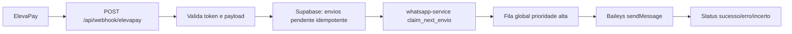
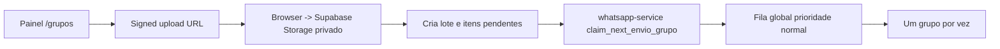

# ElevaZap WhatsApp Ops

Ferramenta interna e isolada para comunicação via WhatsApp com compradores, alunos e grupos próprios em que o número já participa. Não é ferramenta de spam, não importa lista fria, não adiciona membros em massa, não cria grupos automaticamente, não promete anti-ban e não tenta burlar regras do WhatsApp.

## Arquitetura

O monorepo tem dois serviços:

- `web/`: Next.js 14 com App Router, TypeScript e Tailwind, pensado para Vercel.
- `whatsapp-service/`: Node.js 24/7 com Express e Baileys, pensado para Railway ou VPS.

O Baileys mantém WebSocket persistente e não deve rodar em Vercel/serverless. O navegador nunca recebe `SUPABASE_SERVICE_KEY`, `INTERNAL_API_KEY`, `WHATSAPP_SERVICE_URL`, `ELEVAPAY_WEBHOOK_TOKEN`, `ADMIN_PASSWORD_HASH` ou `AUTH_SECRET`. Todas as chamadas ao serviço WhatsApp passam por API routes server-side do Next.





## Máquina De Estados

Boas-vindas: `pendente -> enfileirado -> processando -> sucesso|erro|incerto`. Também permite `pendente <-> pausado`, `enfileirado -> pendente`, e resolução manual de `incerto -> sucesso|erro|pendente`.

Grupos: `pendente -> enfileirado -> processando -> sucesso|erro|incerto`, com `pausado` e `cancelado` para pendentes/enfileirados/pausados.

Status `incerto` existe porque não há exactly-once perfeito em WhatsApp: se o processo cair durante `processando`, o serviço não sabe com segurança se a mensagem saiu. Por isso item incerto nunca é reenviado automaticamente. Boas-vindas incertas aparecem como alerta crítico; grupos incertos como alerta operacional.

`claim_token` impede envio de item pausado, cancelado ou alterado enquanto ainda estava em buffer local. Antes de `sendMessage`, o serviço só move para `processando` se `status = enfileirado` e `claim_token` bater.

A fila é global, única e serial. Boas-vindas e testes têm prioridade alta; grupos têm prioridade normal. Prioridade muda ordem, não cria concorrência. O serviço usa buffer pequeno e não pré-enfileira lote inteiro. Em lotes de grupo, o primeiro disparo sai assim que o item é processado e os seguintes respeitam o intervalo global.

## Supabase

1. Crie um projeto Supabase.
2. Aplique os arquivos de `supabase/migrations/` em ordem numérica.
3. Confirme que RLS está habilitado em todas as tabelas.
4. Não crie policies permissivas para `anon`; o acesso a dados é server-side com service role.
5. Crie bucket privado `whatsapp-media`.
6. Configure allowed mime types e limite de tamanho:
   - imagens: jpg/jpeg/png/webp até 5MB;
   - vídeo mp4 até 16MB;
   - áudio mp3/m4a/wav/ogg até 16MB;
   - documentos permitidos até 100MB.
7. Observe o limite de 100MB do plano Supabase.

## Variáveis

Copie `web/.env.example` e `whatsapp-service/.env.example`.

Gerar senha admin:

```bash
node -e "const bcrypt=require('bcryptjs'); bcrypt.hash('sua-senha-forte', 12).then(console.log)"
```

Gerar `AUTH_SECRET`:

```bash
openssl rand -base64 32
```

Defaults recomendados no serviço:

```env
GLOBAL_SEND_THROTTLE_MS=2000
LOCK_TTL_SECONDS=60
WELCOME_UNCERTAIN_POLICY=manual
```

## Deploy

### Railway ou VPS

- Deploy de `whatsapp-service/`.
- Mantenha 1 réplica.
- Desligue autoscaling.
- Instale ffmpeg. O arquivo `whatsapp-service/nixpacks.toml` já inclui `ffmpeg`.
- Baileys está pinado em `6.7.23`, sem `^`, `~` ou `latest`.
- Configure `INTERNAL_API_KEY` igual ao valor usado no `web/`.

### Vercel

- Deploy de `web/`.
- Configure todas as env vars de `web/.env.example`.
- `NEXT_PUBLIC_APP_URL` deve ser a origem pública exata do painel.
- Acesse `/login`, entre com `ADMIN_EMAIL` e a senha correspondente ao hash.

## Operação

- `/conexao`: escaneie o QR Code e acompanhe status do socket.
- `/mensagem`: edite `welcome_message` com suporte a `{{nome}}`; o teste cria job pendente, não envia pela Vercel.
- `/grupos`: atualize grupos próprios, organize grupos em campanhas e crie lote com texto, imagem, vídeo, áudio, áudio de voz ou documento.
- Upload de mídia é direto do browser para Supabase Storage via signed upload URL; arquivo não passa por API route do Next e não usa base64.
- `/lotes`: pause, retome ou cancele pendentes.
- `/envios` e `/envios-grupo`: acompanhe histórico e erros.
- `/incertos`: marque sucesso, erro ou reenvie manualmente. Reenvio de incerto só acontece por ação humana.
- `/configuracoes`: veja status de serviço, lock, fila, ffmpeg e versão do Baileys sem expor segredos.

## Webhook ElevaPay

URL:

```text
https://seu-dominio.com/api/webhook/elevapay
```

Header:

```text
x-elevapay-token: valor_configurado_em_ELEVAPAY_WEBHOOK_TOKEN
```

Payload:

```json
{
  "event": "compra.aprovada",
  "order_id": "ord_123",
  "transaction_id": "txn_456",
  "nome": "Fulano de Tal",
  "telefone": "5511999999999",
  "produto": "Shop Lab",
  "email": "fulano@email.com"
}
```

Respostas:

```json
{ "ok": true }
```

```json
{ "ok": true, "duplicado": true }
```

O endpoint valida token, payload, telefone, rate limit persistente e grava job idempotente com `transaction_id`. Ele responde rápido e nunca depende de processamento assíncrono da Vercel depois da resposta.

## Segurança

- Login admin usa bcrypt e cookie HTTP-only.
- Cookie é `secure` em produção e `sameSite=lax`.
- API admin exige sessão.
- Rotas administrativas mutáveis validam `Origin`/`Referer` contra `NEXT_PUBLIC_APP_URL`.
- Webhook não usa Origin check porque vem de origem externa; usa `x-elevapay-token` e rate limit persistente.
- Rate limit usa tabela `rate_limits`, não memória serverless.
- Auth state do Baileys é granular em `whatsapp_auth_creds` e `whatsapp_auth_keys`, sem arquivo local e sem JSONB gigante único.
- Single-instance lock usa RPC atômica em `service_lock`; se o lock estiver recente, outra instância encerra.
- O projeto mantém Next.js 14 por requisito. Se a política de segurança do seu ambiente exigir zerar todos os avisos de `npm audit`, avalie uma janela de upgrade para Next 16 e revalide o App Router antes do deploy.

## Testes

```bash
npm install
npm test
```

Cobertura mínima incluída:

- normalização, máscara e JID;
- validação de grupo;
- payload webhook;
- validação de mídia;
- claim token antes de processar;
- item pausado/cancelado não processa;
- processando antigo vira incerto;
- enfileirado antigo volta para pendente;
- incerto não reenvia automaticamente;
- prioridade de boas-vindas sobre grupos.

## Checklist De Produção

- Railway com 1 réplica.
- Autoscaling desligado.
- ffmpeg instalado.
- Baileys pinado.
- Supabase migrations aplicadas.
- RLS habilitado.
- Bucket privado `whatsapp-media` criado.
- Limites do bucket configurados.
- Env vars configuradas nos dois serviços.
- `ADMIN_EMAIL`, `ADMIN_PASSWORD_HASH` e `AUTH_SECRET` fortes.
- Webhook ElevaPay configurado.
- WhatsApp conectado por QR.
- Envio teste funcionando.
- Grupo listado.
- Lote teste criado.
- Histórico registrando.
- Dashboard carregando.
- Login protegendo painel.
- API interna protegida.
- Webhook protegido.
- Rate limit persistente funcionando.
- Fila com prioridade validada.
- Incertos aparecendo na UI.
